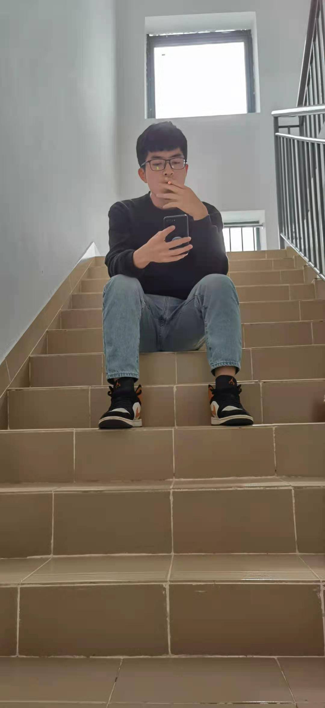

#  黄继安的毕业论文，上传于3.30

###   这一路的心路历程真不容易，感谢所有给予过我帮助的人，特别是我的论文导师李艳，我的人生挚友章俊鑫，钟海旭，感谢。

###  论文中有关的实验，是在AIStudio上面找的项目，感兴趣的可以[点这直达](https://aistudio.baidu.com/aistudio/projectdetail/474523?channelType=0&channel=0)

###  里面有LeNet、AlexNet、VGG、GoogleNet、ResNet网络的编写，都是基于paddle，也是由衷的感觉到国家越来越强大，百度为我们提供了很好的学习环境，希望自主的品牌能越做越好  ~  

###  很多人吐槽paddle不好用，是，确实，版本问题有时候搞得很头大，但是你不用，我不用，paddle何时勇？

####  write at 2021年3月30日14:36:32

#  ------------------------分割线----------------------

